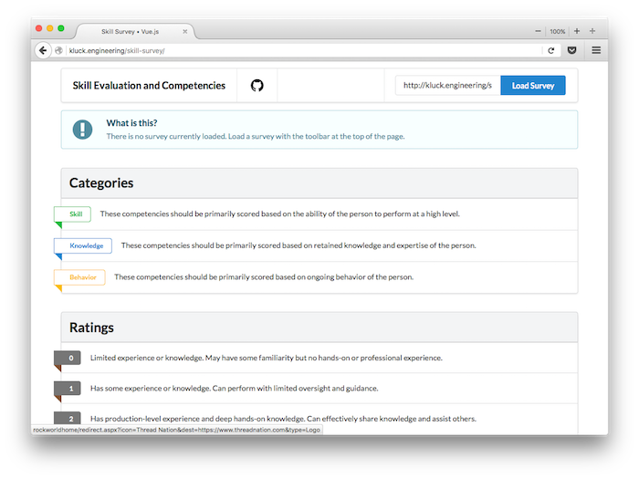
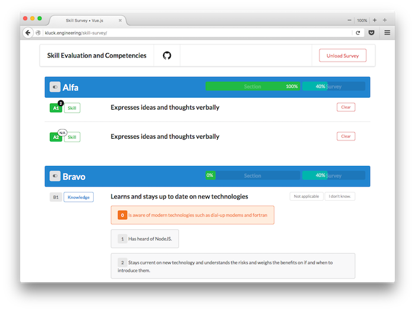
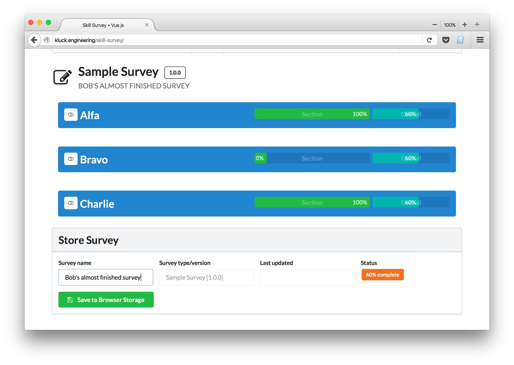
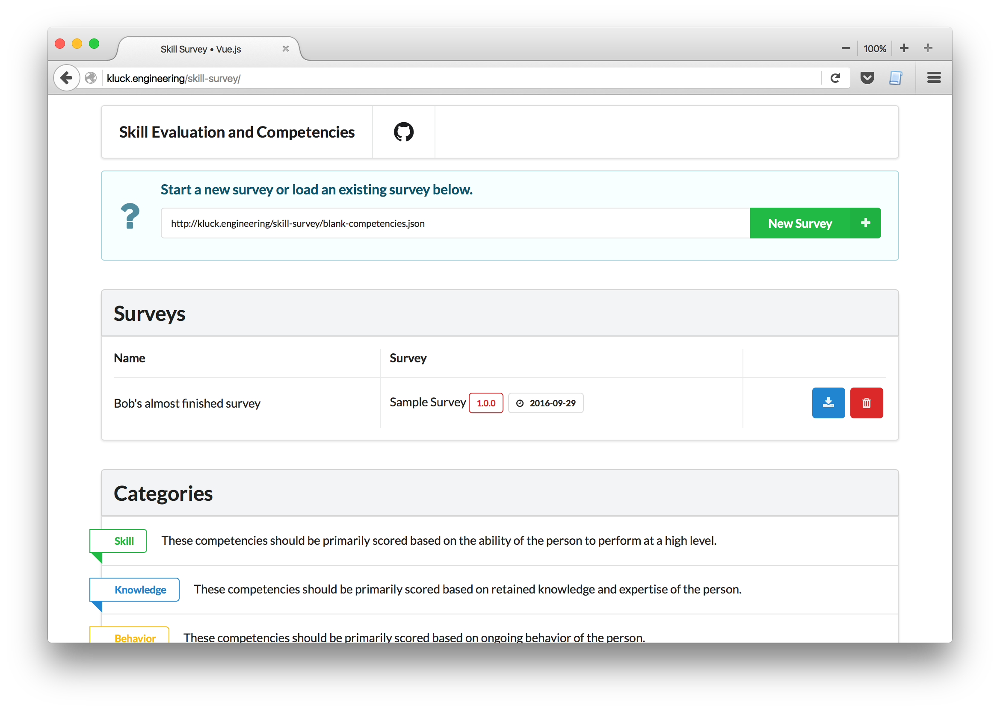
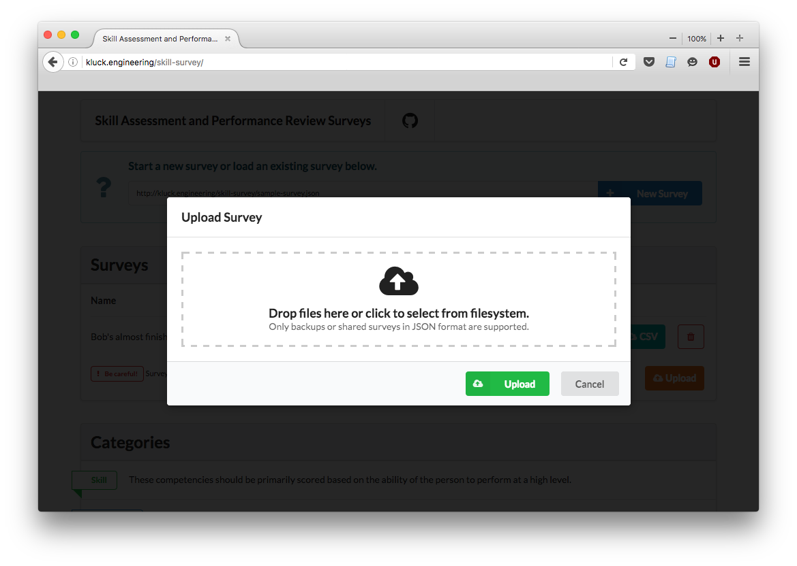

# Skill Assessment and Performance Review Survey Manager

Vue.js / Semantic UI frontend app for skill assessment and performance reviews.

This single-page application allows users to easily fill out peer or self-evaluations for skill assessment.

### Features

- Clean, easy to use user experience and design.
- Surveys consist of a list of sections and specific asdasd or *competencies* within each section.
    - Competencies are scored from 0-3.
    - Competencies can also be marked as **I don't know** or **Not applicable** for peer reviewers.
    - Extra comments can be made on each competency to provide more context for a rating.
- Viewing
    - Read-only and summary modes to optimize experience for reviewing surveys.
- Taking
    - Surveys can be partially finished, saved, and resumed at a later time.
- Saving
    - Surveys are saved to local browser storage for persistence
- Exporting
    - Surveys can be backed up the filesystem and shared or downloaded as CSV.

## Creating a survey

tbd

## Quick links

- [VueJS 2.0 RC Docs](http://rc.vuejs.org/guide/)
- [Semantic UI 2.2 Docs](http://semantic-ui.com/introduction/getting-started.html)

## TODO

- [x] Import new survey
- [x] Save survey
- [x] Load survey
- [x] Sections
- [x] Automatic tabulation / progress
- [x] Ability to add comments
- [x] Export finished survey
- [x] Import finished survey (read-only)
- [x] "Completed" screen with stats
- [x] Support drop-down / multiple new survey sources
- [x] Add documentation in README (features, abilities)
- [x] Download as CSV
- [x] Download as PDF
- [x] Add better error handling, validation of import/exported surveys
- [ ] Cross-browser testing
    - [ ] IE 11
        - [ ] Cannot click ratings
        - [ ] Cannot drag and drop files
        - [ ] Cannot click to upload files
        - [ ] Typing comments seems slow
        - [ ] Long competencies do not text wrap
    - [ ] Edge
    - [ ] Firefox
        - [ ] Selecting a rating is slow. The further into the survey - the longer it freezes.
    - [x] Chrome
- [ ] MVP Done
- [ ] Add editor for creating survey blanks
- [ ] Add build process (so files can be [modularized](https://vuex.vuejs.org/en/structure.html) using `.vue`)
- [ ] Add better documentation for filling out surveys, creating blanks
- [ ] Ensure responsive-ness

### Home page - no survey loaded

### Taking new survey

### Saving surveys

### Loading existing surveys

### Uploading saved surveys

